# Faerie Fire Cultivation Lifecycle

This diagram shows how raw activity becomes evidence, facts, beliefs, questions,
conversation context, and durable exports. `living_computer.db` holds captured
events; the fact, evidence, inference, curiosity, and goal tables share `memory.db`.
SQLite remains the source of truth; Notion is an explicit downstream mirror.

```mermaid
flowchart TB
    classDef source fill:#10251b,stroke:#53e7c0,color:#edf5f0
    classDef process fill:#122219,stroke:#70d69e,color:#edf5f0
    classDef store fill:#172033,stroke:#8ea7e8,color:#edf5f0
    classDef gate fill:#302619,stroke:#ffd166,color:#fff4d6
    classDef human fill:#2b1930,stroke:#e79cff,color:#fff0ff
    classDef output fill:#172a22,stroke:#2fe3a0,color:#edf5f0
    classDef rejected fill:#291a20,stroke:#ff6b8a,color:#ffe8ee

    subgraph S1["1 · Experience enters the garden"]
        LIFE["Computer activity<br/>windows · screen/OCR · clipboard · browser"]:::source
        JOURNAL["Journals and notes<br/>dated .md · .txt · .docx"]:::source
        DIRECTIVE["Your standing curiosity<br/>a goal to actively learn about"]:::human
        GOAL_INPUT["Your Actualized Self plan<br/>overgoals · subgoals · tasks"]:::human
        TALK["Your companion / assistant message"]:::human
        REVIEW["Your inference decision<br/>Accept · Tentative · Reject · Needs evidence"]:::human
        INVESTIGATE["Your directed investigation<br/>what should Faerie try to understand?"]:::human
        FORGET["Explicitly forget a memory"]:::human
    end

    subgraph S2["2 · Capture safely and locally"]
        TRAY["tray.py<br/>owns capture + scheduler threads"]:::process
        PRIVACY{"Foreground app<br/>blocklisted?"}:::gate
        SAMPLE["Collectors + sampler<br/>capture changes, idle checkpoints, extras"]:::process
        EVENTS[("living_computer.db<br/>encrypted payloads + watermarks")]:::store
        BLOBS[("data/blobs<br/>encrypted retained screenshots/assets")]:::store
        BLOCKED["Do not capture<br/>and never send to a model"]:::rejected
    end

    LIFE --> TRAY --> PRIVACY
    PRIVACY -- "yes" --> BLOCKED
    PRIVACY -- "no" --> SAMPLE
    SAMPLE --> EVENTS
    SAMPLE --> BLOBS

    subgraph S3A["3A · Distil observable facts"]
        AGG["Aggregate a fresh event window<br/>exclude Faerie Fire's own windows"]:::process
        LOCAL["Raw summary stays local"]:::store
        REDACT["Redact cloud-bound summary"]:::process
        RECALL["Retrieve relevant active memories"]:::process
        TRIAGE["Triage model<br/>statements + supersessions"]:::process
        FACT_GATE{"Confidence at or above<br/>auto-commit threshold?"}:::gate
        DROP["Drop low-confidence facts<br/>and triage questions"]:::rejected
        WATERMARK["Commit facts + triage watermark atomically<br/>only after model success"]:::process
    end

    EVENTS --> AGG --> LOCAL --> REDACT --> RECALL --> TRIAGE --> FACT_GATE
    FACT_GATE -- "yes · default ≥ 0.75" --> MEMORY
    FACT_GATE -- "no" --> DROP
    TRIAGE --> WATERMARK --> EVENTS
    MEMORY -. "relevance context" .-> RECALL

    subgraph S3B["3B · Grow interpretations from repeated evidence"]
        FRESH["Fresh event window + dwell patterns<br/>inference watermark"]:::process
        OBSERVE["Observe<br/>turn behavior into small themed evidence"]:::process
        EVIDENCE[("Evidence table<br/>idempotent · grouped by independent activity window")]:::store
        SYNTH["Synthesise each touched theme<br/>all evidence + prior decisions"]:::process
        CONF["Hybrid confidence<br/>model estimate + independent evidence"]:::process
        BELIEF_GATE{"Enough evidence and<br/>confidence across the 80% gate?"}:::gate
        FORMING["Forming theme<br/>progress only, no question yet"]:::process
        PENDING["Inference card awaiting Address"]:::gate
        ADDRESS["Persistent Address conversation<br/>one decision-bearing question at a time"]:::process
        CANONICAL[("Canonical approved or tentative belief")]:::store
        WAITING[("Unresolved investigation<br/>waiting for better evidence")]:::store
        REJECTION[("Rejected wording constraint<br/>underlying evidence is retained")]:::store
    end

    EVENTS --> FRESH --> OBSERVE --> EVIDENCE --> SYNTH --> CONF --> BELIEF_GATE
    MEMORY -. "relevant facts condition observation" .-> OBSERVE
    CANONICAL -. "existing beliefs + duplicate guard" .-> SYNTH
    REJECTION -. "do not repeat this wording" .-> SYNTH
    BELIEF_GATE -- "below gate or too little evidence" --> FORMING
    BELIEF_GATE -- "default ≥ 0.80 and ≥ 3 evidence" --> PENDING
    PENDING --> ADDRESS
    INVESTIGATE --> ADDRESS
    MEMORY -. "relevant facts" .-> ADDRESS
    EVIDENCE -. "relevant observations" .-> ADDRESS
    CANONICAL -. "existing self-model" .-> ADDRESS
    ADDRESS --> REVIEW
    REVIEW -- "Accept or tentative<br/>with editable wording" --> CANONICAL
    REVIEW -- "Reject" --> REJECTION
    REVIEW -- "Needs more evidence" --> WAITING
    CANONICAL -. "semantic matches attach as evidence<br/>instead of another card" .-> SYNTH
    FORMING -. "more activity" .-> EVIDENCE

    subgraph S3C["3C · Pursue what you explicitly want to understand"]
        CURIO[("Active curiosity<br/>one may be marked greatest")]:::store
        CURIO_CONTEXT["Relevant facts + confirmed beliefs<br/>open, answered, and dismissed items"]:::process
        GENERATE["Generate a fresh round<br/>greatest gets the larger budget"]:::process
        ITEM_GATE{"Item grounded and<br/>confident enough?"}:::gate
        OPEN_Q["Open question<br/>default ≥ 0.70"]:::gate
        OPEN_S["Open suggestion<br/>default ≥ 0.80"]:::gate
        ANSWER["You answer<br/>exact words remain authoritative"]:::human
        DISMISS["Dismiss<br/>no memory created"]:::rejected
        RESOLVE["Resolve answer into<br/>attribute + value"]:::process
        RESPONSE["Tried · not helpful lightly/heavily"]:::human
    end

    DIRECTIVE --> CURIO --> CURIO_CONTEXT --> GENERATE --> ITEM_GATE
    MEMORY -.-> CURIO_CONTEXT
    CANONICAL -.-> CURIO_CONTEXT
    ITEM_GATE -- "question" --> OPEN_Q
    ITEM_GATE -- "suggestion" --> OPEN_S
    ITEM_GATE -- "below threshold / duplicate" --> DROP
    OPEN_Q --> ANSWER --> RESOLVE --> MEMORY
    OPEN_Q --> DISMISS
    OPEN_S --> RESPONSE
    MEMORY -. "better context grows the next round" .-> CURIO_CONTEXT

    subgraph S3D["3D · Turn intentions into an owned plan"]
        GOALS[("Encrypted Actualized Self tree<br/>Soul · Roots · nested Branches · Leaves")]:::store
        PLAN["Native planning-agent window<br/>one decision-bearing question at a time"]:::process
        DRAFT["Editable draft subtree<br/>nothing active yet"]:::gate
        COMMIT{"Explicitly create plan?"}:::gate
        COMPLETE["Manual Leaf completion<br/>completion progress only"]:::human
        MASTERY["Opt-in mastery profile<br/>explicit assessments + milestones"]:::process
        AGENTS[("One bounded GoalAI agent per node<br/>encrypted brief + assessment history")]:::store
        AGENT_RUN["Bottom-up GoalAI sweep<br/>Leaf → Branch → Root → Soul"]:::process
        AGENT_GATE{"Commit selected staged<br/>hierarchy changes?"}:::gate
        AGENT_CHAT["Native node-agent window<br/>bounded hierarchy context only"]:::human
        MEMORY_CANDIDATE["Accomplishment memory candidate<br/>exact wording awaits approval"]:::gate
        HARVEST["Harvest a Soul / Root / Branch / Leaf<br/>distill reusable learning"]:::process
        UPWARD["Committed harvest flows upward<br/>full learning reaches the Soul"]:::process
        ROUTE["Soul-approved crossover route<br/>selected excerpts only"]:::gate
    end

    GOAL_INPUT --> GOALS
    OPEN_S -- "Implement" --> PLAN --> DRAFT --> COMMIT
    COMMIT -- "yes" --> GOALS
    COMMIT -- "keep refining" --> PLAN
    GOALS --> COMPLETE --> GOALS
    GOALS --> MASTERY
    CURIO -. "attachable research loop" .-> GOALS
    GOALS --> AGENTS
    AGENT_RUN --> AGENTS
    AGENTS -- "structured child reports flow upward" --> AGENTS
    AGENTS -- "questions + proposals" --> AGENT_GATE
    AGENT_GATE -- "approve" --> GOALS
    AGENT_GATE -- "dismiss / refine" --> AGENTS
    AGENT_CHAT --> AGENTS
    AGENT_CHAT --> MEMORY_CANDIDATE
    MEMORY_CANDIDATE -- "explicit Save to Memory" --> MEMORY
    AGENTS --> HARVEST --> UPWARD --> AGENTS
    UPWARD --> ROUTE
    ROUTE -- "explicit Soul harvest commit" --> AGENTS

    subgraph S4["4 · The cultivated second brain"]
        MEMORY[("memory.db · active facts<br/>dated supersessions · approved links")]:::store
        IMPORT["Parse · date · filter · redact<br/>chronological journal extraction"]:::process
        CLARIFY["Clarify uncertain memories<br/>hedges · dates · age/grade conflicts"]:::process
        CONSOLIDATE["Consolidate<br/>close duplicates; never delete memory rows"]:::process
        SELECT["Deterministic context selection<br/>relevant memories, never destructive"]:::process
        ERASE["Hard forget<br/>fact + linked edges/answers/clarifications"]:::process
    end

    JOURNAL --> IMPORT --> MEMORY
    MEMORY --> CLARIFY
    CLARIFY -- "your answer or safe auto-fix" --> MEMORY
    MEMORY --> CONSOLIDATE --> MEMORY
    MEMORY --> SELECT
    FORGET --> ERASE
    ERASE -. "remove source fact" .-> MEMORY

    subgraph S5["5 · What the cultivated knowledge feeds"]
        GUI["Main Faerie Fire UI<br/>Inferences · Clarify · Curiosity · Goals · Memory · Timeline"]:::output
        COMPANION["Companion<br/>persona + recent redacted screen + selected facts<br/>+ confirmed beliefs + current curiosities"]:::output
        ASSISTANT["Hotkey assistant<br/>recent screen + selected memories"]:::output
        REFLECT["Proactive reflection<br/>offers a confirmed belief back for refinement"]:::output
        NOTION["Notion curiosity mirror<br/>consolidated essentials; manual notes preserved"]:::output
        GOAL_EXPORT["Explicit one-shot Notion goal export<br/>notes + evidence labels remain local"]:::output
        BACKUP["Rotating memory.db backups"]:::output
    end

    MEMORY --> GUI
    FORMING --> GUI
    PENDING --> GUI
    CANONICAL --> GUI
    CURIO --> GUI
    GOALS --> GUI
    MASTERY --> GUI
    AGENTS --> GUI
    SELECT --> COMPANION
    SELECT --> ASSISTANT
    EVENTS -. "recent screen, redacted" .-> COMPANION
    EVENTS -. "recent screen, redacted" .-> ASSISTANT
    CANONICAL --> COMPANION --> REFLECT --> REVIEW
    CURIO --> COMPANION
    TALK --> COMPANION
    CURIO --> NOTION
    GOALS -- "only when requested" --> GOAL_EXPORT
    MEMORY --> BACKUP
    ERASE -. "purge stale snapshots" .-> BACKUP
    ERASE -. "resync active pages" .-> NOTION

    subgraph S6["6 · Cost-bounded daily tending"]
        FAST["Daily inference<br/>Haiku observes → Sonnet synthesizes"]:::process
        DEEP["Manual regeneration<br/>same bounded deduplicated pipeline"]:::process
        NIGHT["8 PM local sequence<br/>inference → curiosity → changed GoalAI<br/>→ housekeeping"]:::process
        CURIO_CLOCK["Curiosity cadence<br/>once daily"]:::process
        GOAL_CLOCK["GoalAI cadence<br/>dirty active paths only; max 12"]:::process
    end

    TRAY --> NIGHT
    NIGHT --> FAST --> FRESH
    DEEP --> FRESH
    NIGHT --> FRESH
    NIGHT --> AGG
    NIGHT --> CONSOLIDATE
    NIGHT --> BACKUP
    NIGHT --> CURIO_CLOCK --> GENERATE
    CURIO_CLOCK --> NOTION
    NIGHT --> GOAL_CLOCK --> AGENT_RUN
```

## Reading the lifecycle

- **Facts** describe things the system believes happened or are true. Confident
  triage results and answered curiosity questions become facts in `memory.db`.
- **Evidence** is quieter and smaller than a fact. It accumulates until repeated
  behavior can support an inference; it is not shown as a claim by itself.
- **Beliefs** are interpretations of repeated evidence. Crossing the confidence
  gate only makes a hypothesis addressable. A persistent conversation can
  revise, reject, or park it; only explicit acceptance creates a canonical
  belief. Later semantic repeats are absorbed instead of becoming new cards.
- **Directed investigations** let the user aim the same reasoning loop with a
  question such as “why do I avoid X?” They use relevant memories, behavioral
  evidence, and the existing self-model, but cannot approve their own result.
- **Curiosities** are the intentional growth loop. They turn a goal into a
  continuing queue, and answers feed new facts back into future rounds.
- **Goals** are the user-owned plan: one Soul contains Roots, nested Branches,
  and actionable Leaves. Leaf completion rolls up separately from
  opt-in, evidence-backed mastery; passive capture never completes a task or
  awards mastery.
- **GoalAI agents** are bounded to one node and its branch. They may update
  their own briefs and health reports, but hierarchy changes and accomplishment
  memories remain proposals until explicitly approved.
- **Harvests** distill reusable preferences, constraints, methods, decisions,
  and lessons. A committed Leaf/Branch/Root harvest flows upward to the Soul.
  Only the Soul may route selected insight excerpts downward into another Root,
  so crossover does not grant sibling agents unrestricted context.
- **Selection is non-destructive.** Prompt limits choose which memories are
  useful for one request; they never edit or remove the stored memory graph.
- **Forgetting is explicit and destructive.** It removes the source fact and
  linked same-database traces, purges stale memory backups, and refreshes enabled
  mirrors so a deleted fact is not silently reintroduced from a downstream copy.
- **Mirrors are downstream.** Notion and backups do not replace the
  SQLite stores. A failed export cannot erase the cultivated source data.

Thresholds and cadences shown are current defaults and remain configurable.
Each scheduled model cadence is claimed before its work begins. A model,
Notion or individual-agent failure therefore waits for the next normal
daily cycle instead of retrying on the scheduler's short polling loop. GoalAI
does not become eligible from age alone: meaningful changes persistently dirty
the affected node and ancestors, while unchanged descendants contribute cached
reports without consuming model calls.
