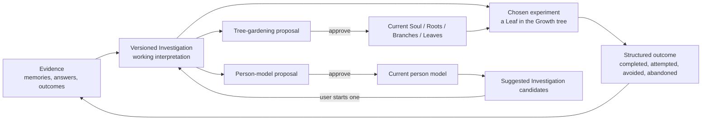
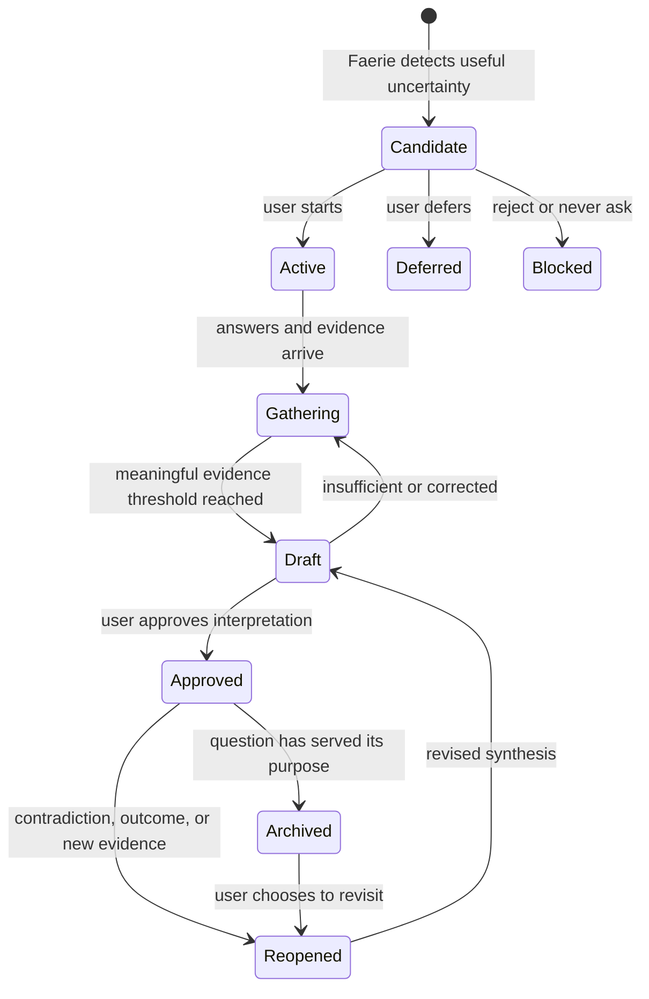
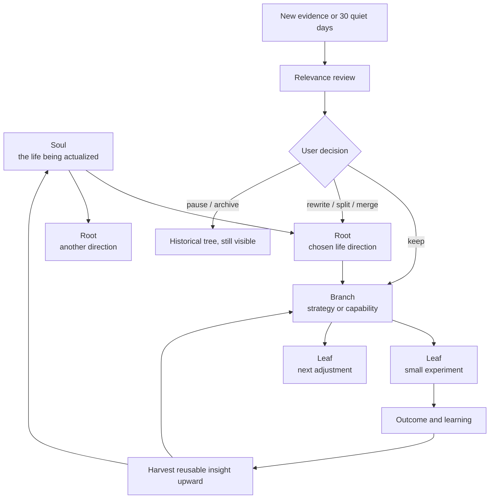
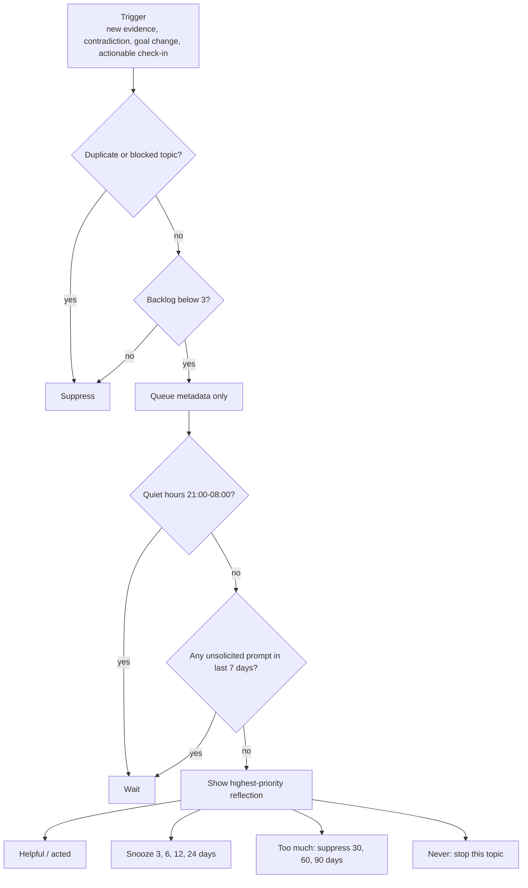

# Faerie Fire Upward-Spiral System

## What was implemented

Faerie Fire now treats its understanding of a person as a revisable working
model, not a permanent profile. Evidence can begin an Investigation, an
Investigation can suggest a small real-life experiment, the outcome becomes new
evidence, and every interpretation can become more specific, less confident,
or obsolete. The Growth tree changes only through user-approved proposals.

The loop is intentionally an upward spiral: returning to a theme is not treated
as failure. Each pass should add context, reveal an exception, reduce an
overgeneralization, or produce a better experiment.

## Authority map

| Layer | What it is allowed to say | Who can change it | History behavior |
|---|---|---|---|
| Memory | What happened or what the person explicitly said | User or existing memory approval rules | Superseded facts remain historical |
| Person-model claim | A tentative pattern across evidence | Faerie proposes; user confirms or rejects | Old wording and evidence remain available |
| Investigation synthesis | The current best interpretation of one question | Faerie drafts; user approves, corrects, or rejects | Every version is preserved |
| Suggested Investigation | A question that may be useful to explore | User starts, refines, defers, rejects, or blocks | Decisions durably prevent repetitive resurfacing |
| Growth tree | The person's chosen direction and experiments | User owns all mutations | Archived nodes remain collapsed history |
| GoalAI proposal | A possible rewrite, split, merge, pause, archive, evidence link, or next Leaf | Faerie proposes; user approves separately | Stale proposals cannot mutate a changed target |
| Reflection cadence | When Faerie may ask for attention | User can act, snooze, ignore, or stop a topic | Only timing, IDs, usefulness, and burden are stored |

## How an Investigation evolves

Each synthesis contains an interpretation, confidence, supporting evidence,
counterevidence, unknowns, experiments, what changed since the prior version,
and conditions that should reopen the question. A low-helpfulness experiment
creates a lower-confidence draft rather than being rationalized as success.

## How the Growth tree evolves

Descendant activity resets a quiet goal's 30-day relevance clock. Paused and
archived nodes stay quiet. "This goal is no longer mine" is treated as a
successful clarification, not a failure.

## The six phases

| Phase | Implemented behavior | Main safeguard |
|---|---|---|
| 1. Versioned synthesis | Investigations form revisable, evidence-linked interpretations | Approval before downstream influence |
| 2. Person-model reconciliation | Claims can be supported, contradicted, narrowed, retired, situational, or changed over time | Strong identity claims require stronger evidence |
| 3. Suggested Investigations | At most two useful candidates are shown; active capacity is capped | Nothing starts automatically; sensitive topics require permission |
| 4. Tree relevance and gardening | Goals can be reviewed, rewritten, split, merged, paused, archived, or kept | Every mutation is a separate approval-gated proposal |
| 5. Experiment outcomes | Completed, attempted, avoided, and abandoned Leaves all create learning | Bad advice lowers confidence; history is preserved |
| 6. Cadence and longitudinal evaluation | All unsolicited reflection paths share quiet hours, weekly cap, backlog, snooze, and suppression | Prompt bodies are not stored in cadence metadata |

## Reflection rhythm

Contradictions are ranked ahead of routine check-ins but do not bypass the
weekly consent cap. Explicit `/remind` reminders are outside this system because
the person intentionally scheduled them.

## What the user sees and controls

- Investigation synthesis history shows what changed and why.
- Suggested Investigations show rationale, expected value, burden, sensitivity,
  and controls to start, refine, defer, reject, or never ask.
- Growth relevance cards show whether a node seems current, questionable,
  outgrown, or unclear, with prior reviews and approval-gated proposals.
- Leaf outcome forms record result, what happened, expected obstacle, surprise,
  helpfulness, changed understanding, and next adjustment.
- The Growth overview shows the Reflection rhythm, pending count, and controls
  for Helpful, Snooze, Too much, and Stop this kind.
- Soul Calibration and Investigations accept encrypted, owner-scoped document
  context. A document can belong to one calibration question, a whole
  Investigation, or one Investigation question, and can be referenced by name
  from the adjacent answer box.

## Storage and privacy

Interpretation payloads, Investigation answers, relevance rationales, outcomes,
and proposed changes use the encrypted memory database. The cadence layer stores
no prompt text or private answer: only prompt kind, opaque subject key, trigger
kind, priority, timestamps, state, and optional 1-5 usefulness/burden ratings.
Existing privacy rules still apply: blocked foreground applications are not
captured or sent to a model, raw triage remains local, cloud-bound summaries are
redacted, and proposed changes do not influence recall before approval.
Document attachments store encrypted extracted text and encrypted filenames;
raw files are not copied. Relevant excerpts enter model context only for the
question or Investigation to which the person attached them.

## Longitudinal scenarios now tested

1. A dream changes and can be revisited without erasing its earlier meaning.
2. A fear hypothesis is contradicted; the contradiction wins queue priority but
   cannot break the weekly cap.
3. A successful exception creates a new synthesis version while the earlier
   interpretation remains historical.
4. A sensitive topic marked never-ask remains blocked across future attempts.
5. Repeated snoozes lengthen automatically; repeated ignores create longer
   periods of quiet.

## Current limits and next tuning work

- The system has automated synthetic journeys, but real usefulness and burden
  still require longitudinal user feedback.
- The default 7-day cap is global. A future version may learn separate rhythms
  for different prompt kinds only after enough explicit feedback exists.
- The cadence tracks a subject key, not semantic similarity between unrelated
  topics. Suggested-Investigation topic keys provide the stronger semantic
  rejection boundary for that subsystem.
- The Growth UI still lives in the large shared `memory.html`; modularizing that
  file remains valuable for reducing UI blast radius.
- Goal relevance uses a conservative 30-day quiet fallback. It should be tuned
  from burden feedback, not shortened merely to increase engagement.

## Verification

The focused upward-spiral suite has 266 passing tests across inference,
Investigation synthesis, suggested candidates, goals, GoalAI, outcomes, cadence,
UI bridges, prompt memory, scheduler behavior, and synthetic journeys. The full
repository collection remains separately blocked by missing legacy launcher or
asset files documented in the phase ledger; that does not affect the focused
upward-spiral verification.
